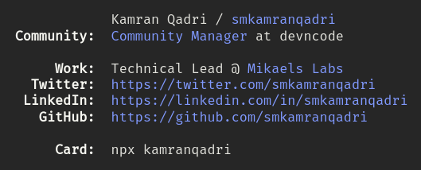

# [codewithowais](https://www.npmjs.com/package/codewithowais)

<center></center>

Excited publish my first npm package.

Created a [business card](https://www.npmjs.com/package/kamranqadri) highly inspired by [ahsanayaz](https://twitter.com/Ahsan_ayz)'s idea he [shared on twitter](https://twitter.com/Ahsan_ayz/status/1076206995965992965).

Run below from your terminal.

```bash
npx codewithowais
```
